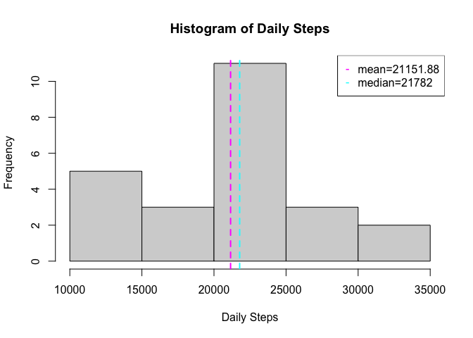
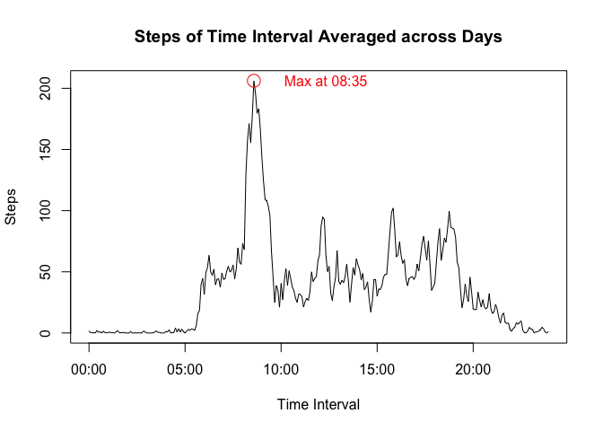
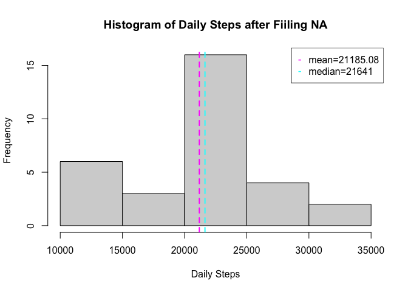
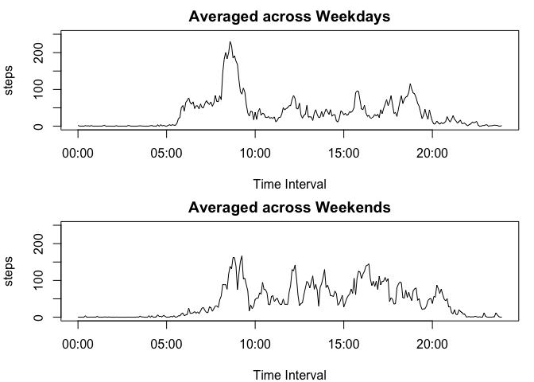

## Loading and preprocessing the data

```r
activity <- read.csv("activity.csv")
```


## What is mean total number of steps taken per day?
#### Calculate the total number of steps for each day

```r
activity$date <- strptime(activity$date, '%Y-%m-%d')
daily_steps <- tapply(activity$steps, activity$date$mday, sum)
```
#### Calculate the mean/median steps

```r
daily_steps_mean <-mean(daily_steps, na.rm=TRUE)
daily_steps_median <- median(daily_steps, na.rm=TRUE)
```

#### Plot histogram of daily steps and display the mean/median

```r
hist(daily_steps, xlab='Daily Steps', main='Histogram of Daily Steps')

legend1 = paste0("mean=", toString(round(daily_steps_mean, digits=2)))
legend2 = paste0("median=", toString(daily_steps_median))
abline(v=daily_steps_mean, col="magenta", lwd=2, lty=2)
abline(v=daily_steps_median, col="cyan", lwd=2, lty=2)
legend("topright", pch='-', col = c("magenta", "cyan"),legend=c(legend1, legend2))
```

<!-- -->


## What is the average daily activity pattern?
#### Calculate the average steps of each time interval across all days 

```r
interval_steps <- tapply(activity$steps, activity$interval, mean, na.rm=TRUE)
```

#### Convert time interval from integers to datetimes
- Just to avoid the discontinuities from n:55 to (n+1):00 
- The 'dates' of these datetimes do not mean anything. 

```r
interval_time <- rep('', times=length(interval_steps))

for (i in 1:length(interval_steps)) {
    ti <- activity$interval[i]
    if (ti < 10) {prefix <- '000'}
    else if (ti < 100) {prefix <- '00'}
    else if (ti < 1000) {prefix <- '0'}
    else {prefix <- ''}
    interval_time[i] <- paste0(prefix, toString(ti))
}

interval_time <- strptime(interval_time, '%H%M')
```

#### Estimate the time interval with maximum steps

```r
id_max <- which.max(interval_steps)
interval_max <- activity$interval[id_max]
```

#### Plot average steps of each time interval and point out the maximum

```r
plot(interval_time, interval_steps, type='l', xlab='Time Interval', ylab='Steps')
title(main='Steps of Time Interval Averaged across Days')

points(interval_time[id_max], max(interval_steps), pch=1, cex=2, col='red')
text(x=interval_time[id_max+45], y=max(interval_steps), label='Max at 08:35', col='red')
```

<!-- -->


## Imputing missing values
#### Calculate the total number of missing values

```r
step_na <- is.na(activity$steps)
sum_na <- sum(step_na)
print(sum_na)
```

```
## [1] 2304
```

#### Fill the missing values with the average steps (across days) at the same time interval

```r
activityFilled <- activity

for (i in 1:nrow(activity)) {
    if (step_na[i]) {
        ti <- as.character(activity$interval[i])
        activityFilled$steps[i] <- interval_steps[ti]
    }
}
```

#### Calculate the total number of step for each day

```r
daily_stepsFilled <- tapply(activityFilled$steps, activityFilled$date$mday, sum)
```

#### Calculate the mean/median steps

```r
daily_stepsFilled_mean <-mean(daily_stepsFilled, na.rm=TRUE)
daily_stepsFilled_median <- median(daily_stepsFilled, na.rm=TRUE)
```

#### Plot histogram of daily steps and display mean/median

```r
hist(daily_stepsFilled, xlab='Daily Steps', main='Histogram of Daily Steps after Fiiling NA')

legend1 = paste0("mean=", toString(round(daily_stepsFilled_mean, digits=2)))
legend2 = paste0("median=", toString(daily_stepsFilled_median))
abline(v=daily_stepsFilled_mean, col="magenta", lwd=2, lty=2)
abline(v=daily_stepsFilled_median, col="cyan", lwd=2, lty=2)
legend("topright", pch='-', col = c("magenta", "cyan"),legend=c(legend1, legend2))
```

<!-- -->

#### My observations for changes after filling missing values
- The values of daily steps slightly decreased.
- The frequency of daily step values increased obviously.


## Are there differences in activity patterns between weekdays and weekends?
#### Create a factor variable: weekday

```r
activityFilled$weekday <- activityFilled$date$wday
activityFilled$weekday <- activityFilled$weekday == 6 | activityFilled$weekday == 0
activityFilled$weekday <- factor(activityFilled$weekday)
levels(activityFilled$weekday) <- c('weekday', 'weekend')
```

#### Calculate the average steps for each time interval across weekdays/weekends
- Store the results with relevant information in a data.frame

```r
groups <- split(activityFilled, list(activityFilled$interval, activityFilled$weekday))
grouped_steps_mean <- sapply(groups, function(x) c('steps'=mean(x[,1]), 'interval'=x[1,3], 'wday'=x[1,4]))
grouped_steps_mean <- data.frame(t(grouped_steps_mean))
```

#### Plot out the aevraged steps vs time interval, for weekdays/weekends seperately 

```r
par(mfrow=c(2, 1), mar=c(4, 4, 2, 1)) 
with(subset(grouped_steps_mean, wday == 1), 
     plot(interval_time, steps, type='l', xlab='Time Interval', main='Averaged across Weekdays', ylim=c(0, 250)))
with(subset(grouped_steps_mean, wday == 2), 
     plot(interval_time, steps, type='l', xlab='Time Interval', main='Averaged across Weekends', ylim=c(0, 250)))
```

<!-- -->

#### My observations for the difference between weekdays and weekends
- In weekends, the peak number of activities decreased.
- The activities became more evenly distributed in daytime from around 8am to 9pm
